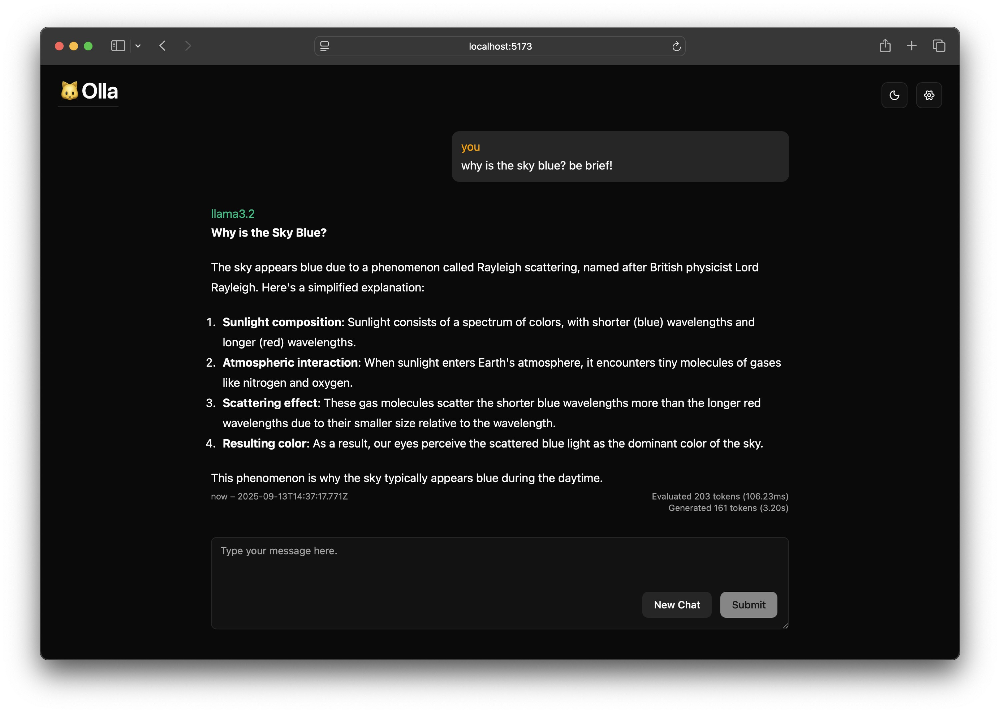

# 🐱 Olla

*A simple ollama chat client for my home network.*

Looked at a few linked on their README, but obviously it's much more fun making your own. Finally gave in and used shadcn.

—Jason (Aug 2025)



# Setup

You will need
- ollama: https://github.com/ollama/ollama
- Node: https://nodejs.org/en/download

At least Node v22
```bash
node -v # v22.18.0
```

Install deps
```bash
npm i
```

Create an `.env` file
```bash
cp .env.example .env
```


# Developing

ollama server should be running:
```bash
./ollama serve
```

Start the dev server:
```bash
npm run dev
```

# Deploying

> [!Note]
> This is geared towards the intel mac that runs ollama in my local network. The chat app is a single-page React app that we'll serve as a static build from the same domain as the ollama server. We'll use nginx to handle either serving the build files for the chat client or forwarding requests to ollama.

## One time setup

- Create a local DNS record for the server machine.
  - Set the domain name you use as the SERVER_NAME value in `.env`.

On the server machine:
- Install ollama.
  - This setup expects it be at `/usr/local/bin/ollama`
- Install and run nginx.
  - I've done this as a `brew` service.
- Run the `setup.sh` script to setup `ollama` as a launchd service and configure nginx as a reverse proxy server for our app.
```bash
./etc/setup.sh
```
- Restart nginx to pick up the new server conf.
```bash
sudo nginx -t # Make sure our conf is good
sudo brew services restart nginx
```

## Publish updates

- Copy/pull this repo
- Build the app
```bash
npm run build
```
- Copy the build artifacts to the site dir
```bash
npm run deploy
```

You should now be able to see the app when you navigate to `http://$SERVER_NAME` while on your local network.

## Updating Ollama

- Download the latest verison.
  ```bash
  curl -vL -o Ollama.dmg https://ollama.com/download/Ollama.dmg
  ```
- Install the new version.
  ```bash
  # https://stackoverflow.com/questions/55869631/how-can-i-silently-install-a-macos-app-from-a-dmg-using-a-single-command
  VOLUME=$(hdiutil attach -nobrowse 'Ollama.dmg' |
      tail -n1 | cut -f3-; exit ${PIPESTATUS[0]}) &&
  (rsync -a "$VOLUME"/*.app /Applications/; SYNCED=$?
      (hdiutil detach -force -quiet "$VOLUME" || exit $?) && exit "$SYNCED")
  ```
- Restart the Ollama server
```bash
launchctl kickstart -k "user/$(id -u)/com.ollama.serve"
```
